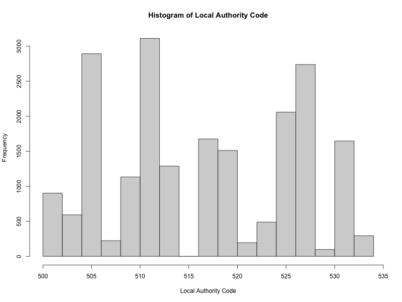
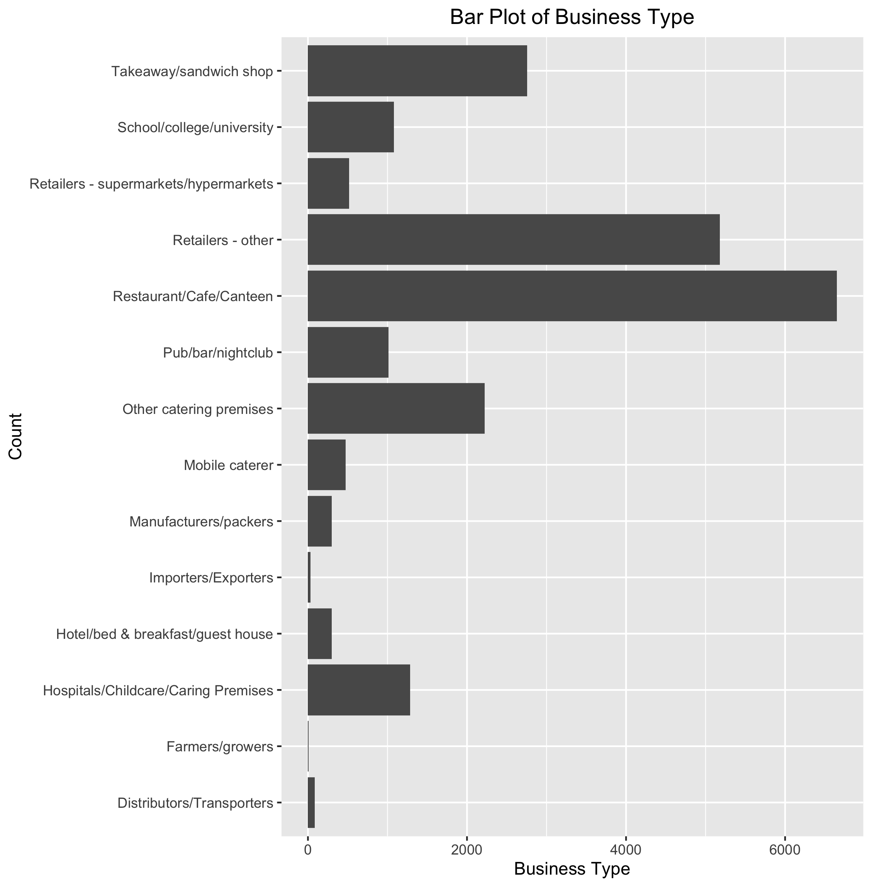
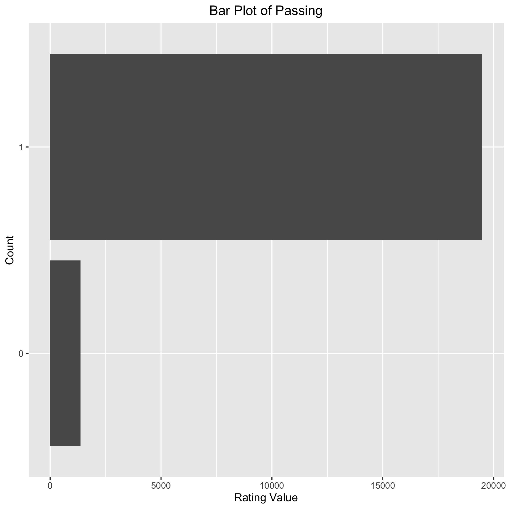

```{r setup, include=FALSE}
knitr::opts_chunk$set(echo = TRUE)
```

## Introduction

<!--Write introduction here-->

## Analysis

Before the real analysis on the dataset, the exploratory data analysis is necessary. In this step, missing values are checked and removed. The dataset will be clean and well-structured for the future analysis. After wrangling the dataset, several plots of exploratory and response variables are created. SInce the response variable `RatingValue` is categorical, we agree that bar plots and histograms are more suitable to explore the data. The plots below are one histogram of `LocalAuthorityCode`, and two bar plots of `BusinessType` and `RatingValue`.

```{r f1, echo=FALSE, fig.cap="Histogram of Local Authority Code", out.width = '75%', out.height="75%"}

```

```{r f2, echo=FALSE, fig.cap="Bar Plot of Business Type", out.width = '100%', out.height="50%"}

```


```{r f3, echo=FALSE, fig.cap="Bar Plot of Rating Value", out.width = '75%', out.height="75%"}

```


