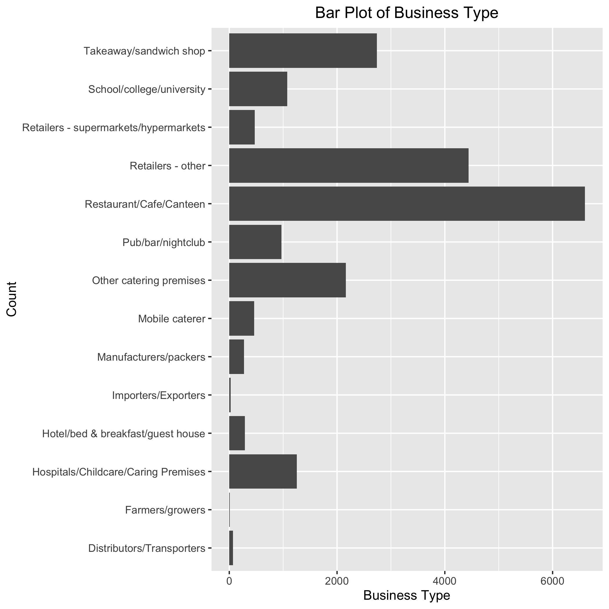

```{r setup, include=FALSE}
knitr::opts_chunk$set(echo = TRUE)
```

## Introduction

Public food safety is of concern to the general population. Food Hygiene Agency in London puts out a report on the food hygiene rating in the boroughs of
London from 2002 to 2022. Based on that, we will investigate the relationship between the food hygiene evaluation and the date of inspection, area (health
authority), and business type of the food service provider. In this study, we define the food provider with food hygiene rating with 3 to 5 as
’good‘ hygiene condition, and 0 to 2 as ‘not good’ hygiene condition to make our food hygiene evaluation as a binary response variable, and we will
exclude the businesses that did not get reviewed and have not been reviewed yet. There are 3 explanatory variables in our study. The food business type is
a categorical variable with 5 levels, including Restaurant/Cafe/Canteen, Retailers-other, Takeaway/sandwich shop, Other catering premises and 
Hospitals/Childcare/Caring Premises. The date of inspection is the date at which the hygiene review took place, from 2002 to 2022, and we will exclude the 
data that does not have a date. In this study, we want to develop a model that explains what determine good or bad in hygiene evaluation for restaurants 
across London as well as helps the public make predictions on the outcome of future restaurants hygiene inspections. 


## Analysis

Before the real analysis on the dataset, the exploratory data analysis is necessary. In this step, missing values are checked and removed. The dataset is cleaned to make sure it is well-structured for fitting the model. We split the `RatingDate` variable into `Year`, `Month`, and `Day`. We also created the response vaeriable `Pass` contains values 0 and 1, where 0 represents the rating below 3, and 1 represents the rating value equal and larger than 3. After wrangling the dataset, several plots of exploratory and response variables are created. Since the response variable `Pass` is categorical, we agree that bar plots and histograms are more suitable to explore the data. The plots below are one histogram of `LocalAuthorityCode`, and two bar plots of `BusinessType` and `Pass`.

```{r f1, echo=FALSE, fig.cap="Histogram of Local Authority Code", out.width = '75%', out.height="75%", fig.align="center"}
knitr::include_graphics("./results/LAC_hist.png")
```

```{r f2, echo=FALSE, fig.cap="Bar Plot of Business Type", out.height="50%", out.width='100%', fig.align="center"}

```


```{r f3, echo=FALSE, fig.cap="Bar Plot of Rating Value", out.width = '50%', out.height="50%", fig.align="center"}
knitr::include_graphics("./results/RV_bar.png")
```


\newpage
We use train-test method to evaluate the final model in this project, hence it is essential to split the dataset into training and testing sets. We use 75% of the data to fit the model, and 25% of the data to test the prediction accuracy.

Since there are not many variables, we decided to train a full logistic regression model contains all the variables. There are only one variable that can be treated as a fector, which is the `BusinessType`. Although the `LocalAuthorityCode` are discrete numbers, and it seems be possible to be treated as a factor as well, the values variate and it will increase the complexity of the model. Hence, it is better to keep it as numerical variable. Moreover, it is no interaction terms in the model, and it is not intuitive to explore any pairs of interactions among these variables. After fitting the model, a summary of the coefficients, test statistics, and Akaike Information Criterion (AIC) values are obtained in the summary of the fitted model. The model summary is attached on the Appendix part.

The prediction results of the testing set are generated using the fitted model to evaluate the accuracy. A confusion matrix is also generated to show the number of true predicted and false predicted values. The matrix and the table of accuracy, as well as its interval is shown below.

```{r echo=FALSE}
acc_df <- read.csv("./results/accuracy.csv")
colnames(acc_df) <- c("Criteria", "Value")
final_acc <- acc_df[1,2]
acc_df
```

```{r echo=FALSE}
cm_df <- read.csv("./results/conf_mat.csv")
colnames(cm_df) <- c("Prediction", "True_Value_0", "True_Value_1")
cm_df
```

The final accuracy of the model is `r final_acc`, and the AIC is almost 7000.

## Conclusion

## Reference

## Appendix - R Script

```{r results='hide',message=FALSE}
# R code for the final project report
library(tidyverse)
library(ggplot2)
library(GGally)
library(rsample)
library(InformationValue)
library(caret)
# Read the dataset
data <- read_csv("./data/food_hygiene_rating_data.csv", col_names=TRUE)

# Clean the dataset
data_eda <- data %>% 
  select(LocalAuthorityCode, RatingDate, BusinessType, RatingValue) %>%
  filter(RatingValue==0 | RatingValue==1 | RatingValue==2 | 
           RatingValue==3 | RatingValue==4 | RatingValue==5) %>%
  mutate(Pass = ifelse((RatingValue >= 3), 1, 0)) %>%
  mutate(Year = format(RatingDate, "%Y") %>% as.numeric(),
         Month = format(RatingDate, "%m") %>% as.numeric(),
         Day = format(RatingDate, "%d") %>% as.numeric(),
         BusinessType = BusinessType <- as.factor(BusinessType)) %>%
  select(-RatingDate) %>%
  drop_na()

```

```{r eval = FALSE}
# Visualization of the dataset
png("results/LAC_hist.png",width=800, height=600)
LAC_hist <- hist(data_eda$LocalAuthorityCode, 
                 xlab="Local Authority Code",
                 main="Histogram of Local Authority Code")
dev.off()

options(repr.plot.width = 15, repr.plot.height = 8)
ggplot(data=data_eda, aes(x=factor(BusinessType))) +
  geom_bar(stat="count") +
  xlab("Count") +
  ylab("Business Type")+
  ggtitle("Bar Plot of Business Type")+
  theme(plot.title = element_text(hjust = 0.5))+
  coord_flip()
ggsave("./results/BT_bar.png")

ggplot(data=data_eda, aes(x=factor(Pass)), height=3) +
  geom_bar(stat="count") +
  xlab("Count") +
  ylab("Rating Value")+
  ggtitle("Bar Plot of Passing")+
  theme(plot.title = element_text(hjust = 0.5))+
  coord_flip()
ggsave("./results/RV_bar.png")
```

```{r eval = FALSE,message=FALSE}
# Split the dataset into training and testing sets
data_split <- initial_split(data_eda, prop = 0.75, strata = RatingValue)
training_data <- training(data_split)
testing_data <- testing(data_split)
test_X <- testing_data %>%
    select(-Pass)
true_vals <- testing_data$Pass

# Fitting the models
mod <- glm(Pass~LocalAuthorityCode+BusinessType+Year+Month+Day, 
           data=training_data, family="binomial")

# Model evaluation
mod_sum <- summary(mod)
pred <- predict(mod, newdata=test_X, type = "response")
cut_off <- optimalCutoff(true_vals, pred)
final_predict <- ifelse(pred > cut_off, 1, 0)
final_predict <- as.factor(final_predict)
true_vals <- as.factor(true_vals)
conf <- confusionMatrix(true_vals, final_predict)
conf_mat <- as.table(conf)
acc <- as.matrix(as.matrix(conf,what="overall")[c(1,2,3,4,5),])
write.csv(acc,file="./results/accuracy.csv")
write.csv(conf_mat, file="./results/conf_mat.csv")
```

